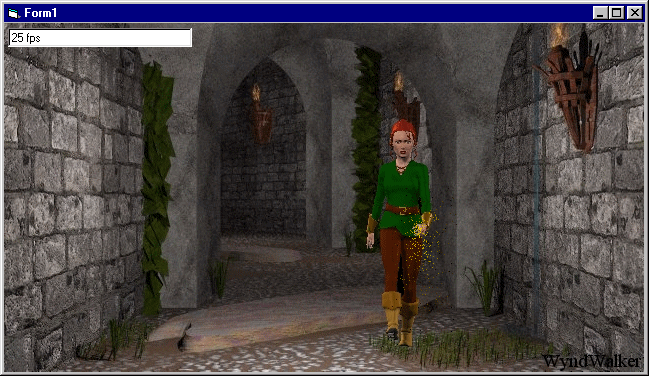



## Sparks \- or how to create fireworks over a background picture\.

### Description

Inspired by the 'Sparks' example entered by Itay Sagui, this demo shows how to display sparks flying out of your mouse, against a background picture, with a programmer-defined color.
 
### More Info
 

             |
---                |---
**Submitted On**   |2000-08-03 14:04:42
**By**             |[Kamilche](https://github.com/Planet-Source-Code/PSCIndex/blob/master/ByAuthor/kamilche.md)
**Level**          |Beginner
**User Rating**    |4.4 (35 globes from 8 users)
**Compatibility**  |VB 5\.0, VB 6\.0
**Category**       |[Graphics](https://github.com/Planet-Source-Code/PSCIndex/blob/master/ByCategory/graphics__1-46.md)
**World**          |[Visual Basic](https://github.com/Planet-Source-Code/PSCIndex/blob/master/ByWorld/visual-basic.md)
**Archive File**   |[CODE\_UPLOAD8564832000\.zip](https://github.com/Planet-Source-Code/kamilche-sparks-or-how-to-create-fireworks-over-a-background-picture__1-10357/archive/master.zip)

